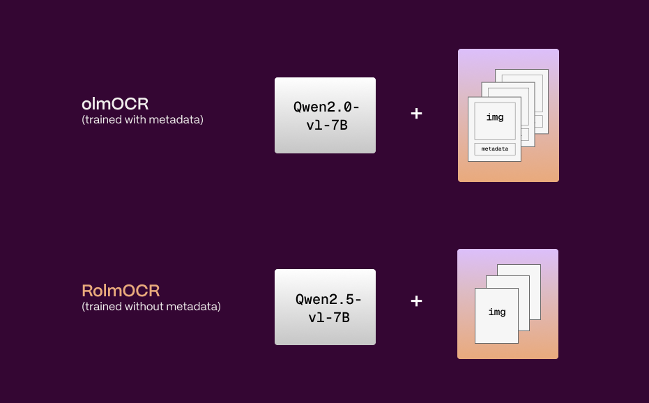
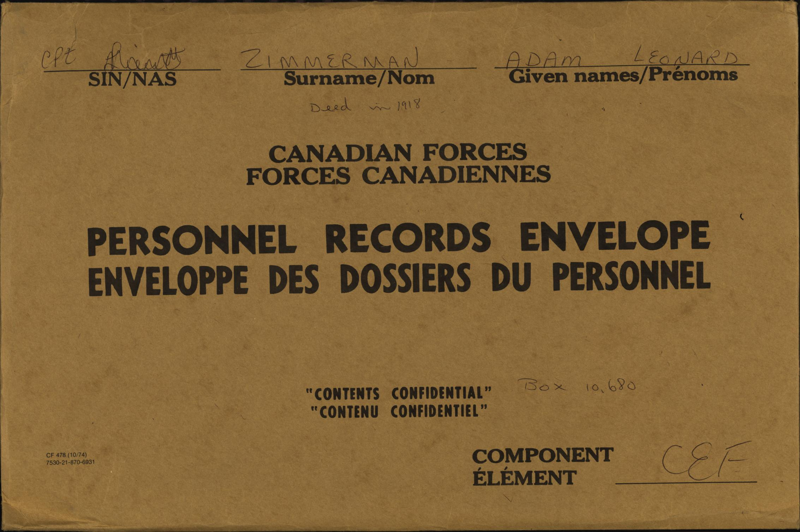
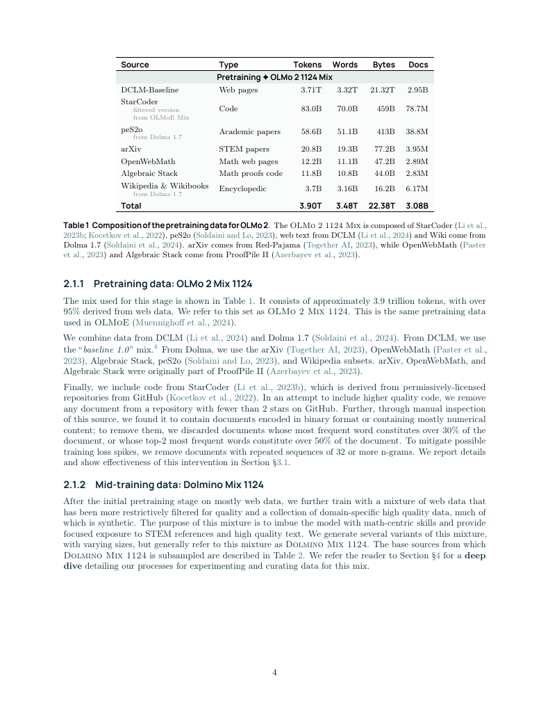

# Introducing RolmOCR: A Faster, Lighter Open Source OCR Model

Earlier this year, the [Allen Institute for AI](https://allenai.org/) released olmOCR, an open-source document OCR model built from a large-scale open dataset and the Qwen2-VL-7B Vision Language Model (VLM). We were excited to see a high-quality, openly available approach to parsing PDFs and other complex documents — and curious to explore what else might be possible using newer foundation models and some lightweight optimizations.

The result is **RolmOCR**, a drop-in alternative to olmOCR that’s faster, uses less memory, and still performs well on a variety of document types. We're releasing it open source for anyone to try out, explore, or build on.

## Key changes

  

We made three notable changes: 

1. **New Base Model**: We swapped in a more recent version of the existing model (Qwen2.5-VL-7B) as the foundation.

2. **No Metadata inputs**: Unlike the original, we don’t use metadata extracted from PDFs. This significantly reduces prompt length, which in turn lowers both processing time and VRAM usage — without hurting accuracy in most cases. 

3. **Rotation of training data:** About 15% of the training data was rotated to enhance robustness to off-angle documents. We otherwise use the same training set. 

## Model comparisons

Across a variety of test documents, **RolmOCR showed either improved or equivalent OCR performance** compared to olmOCR — with much faster inference and lower memory consumption. However, in some select cases, RolmOCR did worse. Below are a few examples comparing model outputs.

### Example 1: Handwritten note

  

Using the same handwritten note example featured on the olmOCR site, RolmOCR produces more accurate results. It correctly captures characters that were previously misread potentially due to corrupted metadata (for instance, “OCLM” is now correctly recognized as “DCLM”). Additionally, it preserves the correct reading order — such as placing “Deepseek Coder” under the appropriate “Data Mixes” section. These details make big differences in terms of downstream parsing and comprehension.

### Example 2: Scanned Envelope 

  

In this case, RolmOCR is able to correctly extract the information from this low-contrast image, while olmOCR does not capture any of the information. This is likely due to a combination of QWen2.5VL's increased capability, and olmOCR's usage on metadata in its training set - there is none available for this image, in this case. 

### Example 3: Academic Paper 

  

This is an example where RolmOCR makes a mistake. It omits a subtitle found in a table of an academic paper. These elements are successfully extracted by olmOCR, which benefits from structured metadata embedded in the document. This highlights one tradeoff of our metadata-free approach: when metadata is present and accurate, it can provide valuable context that improves extraction — especially for structured fields like headers.

## Try RolmOCR

We're releasing it under the Apache 2.0 license for anyone to try out, explore, or build on. You can find instructions, example code, and model details in the README linked here. We’re excited to share RolmOCR with the open source community and hope it’s a useful tool for anyone working with PDFs or complex document layouts.

While RolmOCR is a strong general-purpose option, our own systems support more advanced capabilities — including non-English inputs, layout-aware parsing, and bounding boxes — for teams with more specialized needs.

If you’re curious about those directions or have feedback on the model, we’d love to hear from you! 
